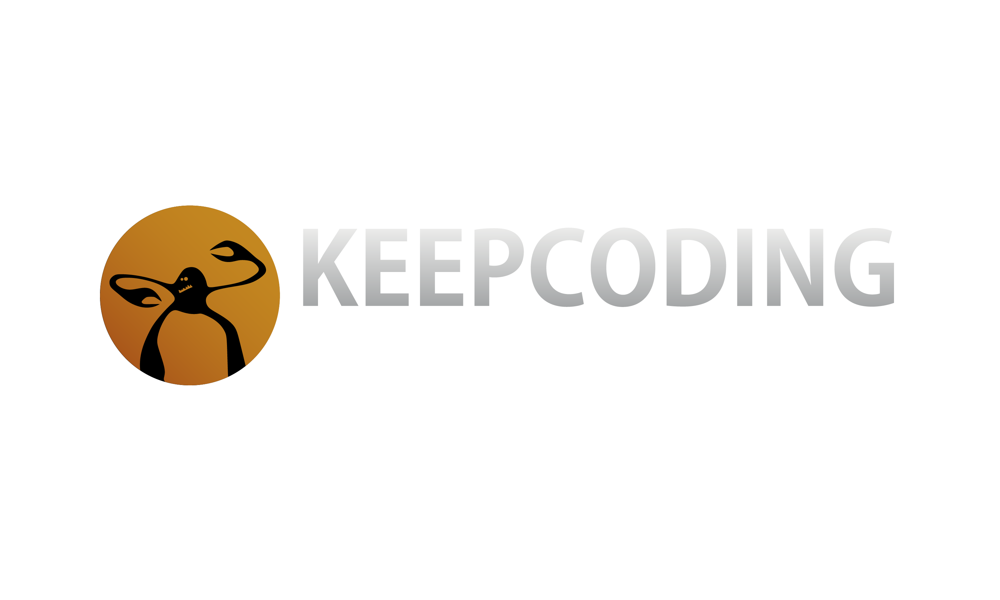

# Keepcoding Bootcamp Exercises

This repository contains exercises from the Keepcoding Bootcamp, covering topics such as Python, HTML, CSS, web development, and more.

## Structure

- **Python:** Exercises and projects related to Python programming.
- **Web Development:** Examples and exercises using HTML, CSS, and related technologies.

Feel free to explore the folders for specific topics and exercises.
